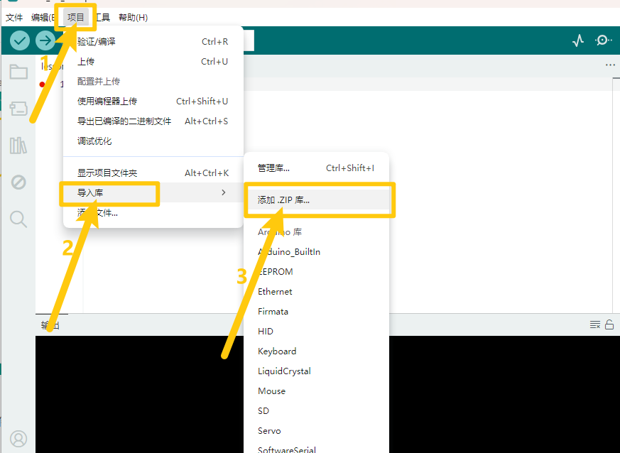
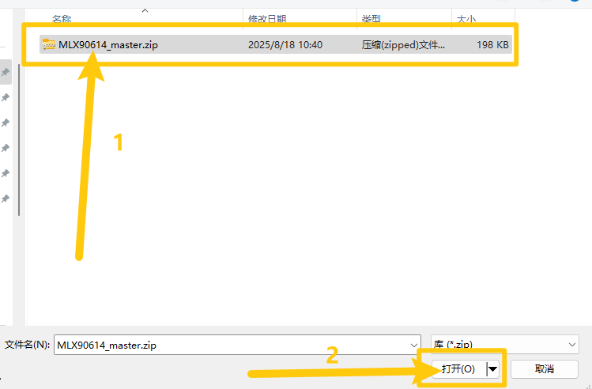
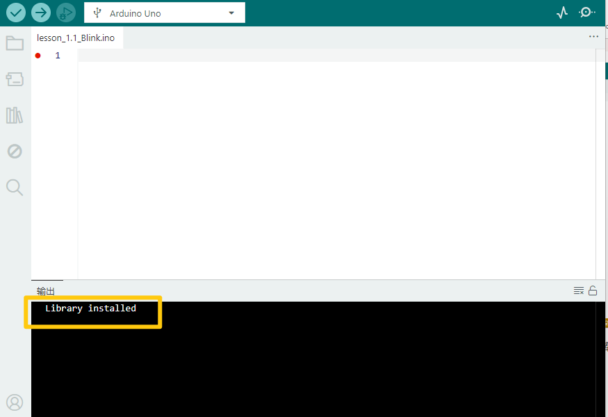
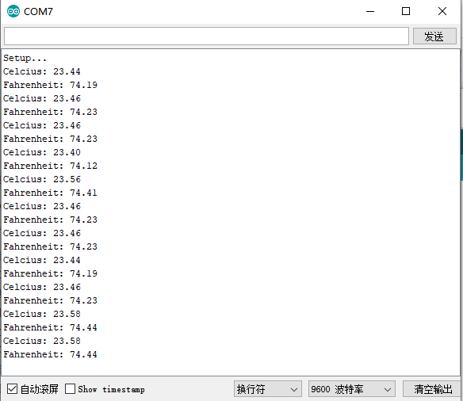

# Arduino


## 1. Arduino简介  

Arduino是一种开源电子原型平台，旨在通过硬件与软件的结合，帮助初学者学习电子和编程。Arduino开发板能够与多种传感器和执行器连接，通过灵活的编程实现各种功能。其易于使用的开发环境和丰富的社区资源，使得用户可以方便地创建互动项目。  

Arduino兼容C/C++编程语言，提供了简单易懂的代码结构，适合学生和爱好者进行学习和实验。由于其高度的可扩展性，Arduino被广泛应用于从基础教育、智能家居到机器人和嵌入式系统等多个领域。  

## 2. 接线图  

  

## 3. 测试代码  

- 下载资料：[Arduino](./Arduino.7z)

- 打开Arduino IDE，选择“项目”，选择“导入库”，再选择“添加.ZIP库”。

  

- 找到下载资料的存放位置，打开文件夹找到库文件，选择要导入的库，点击“打开”。

  

- 安装成功出现的界面。

  

```cpp  
#include <i2cmaster.h>  

void setup() {  
    Serial.begin(9600);  
    Serial.println("Setup...");  
    i2c_init(); // Initialise the I2C bus  
    PORTC = (1 << PORTC4) | (1 << PORTC5); // enable pull-ups  
}  

void loop() {  
    int dev = 0x5A << 1;  
    int data_low = 0;  
    int data_high = 0;  
    int pec = 0;  

    i2c_start_wait(dev + I2C_WRITE);  
    i2c_write(0x07);  

    // read  
    i2c_rep_start(dev + I2C_READ);  
    data_low = i2c_readAck(); // Read 1 byte and then send ack  
    data_high = i2c_readAck(); // Read 1 byte and then send ack  
    pec = i2c_readNak();  
    i2c_stop();  

    // This converts high and low bytes together and processes temperature  
    double tempFactor = 0.02; // 0.02 degrees per LSB (measurement resolution of the MLX90614)  
    double tempData = 0x0000; // zero out the data  

    // This masks off the error bit of the high byte, then moves it left 8 bits and adds the low byte.  
    tempData = (double)(((data_high & 0x007F) << 8) + data_low);  
    tempData = (tempData * tempFactor) - 0.01;  

    float celcius = tempData - 273.15;  
    float fahrenheit = (celcius * 1.8) + 32;  

    Serial.print("Celcius: ");  
    Serial.println(celcius);  
    Serial.print("Fahrenheit: ");  
    Serial.println(fahrenheit);  

    delay(1000); // wait a second before printing again  
}  
```

## 4. 实验说明  

在实验中，我们需要先把编码器的库 `MLX90614_master` 导入到我们的IDE库文件夹中，否则编译将无法通过。  

## 5. 测试结果  

按照接线图接好线，上传代码并上电后，打开串口监视器，设置波特率为9600，将手靠近模块的感应处，监视串口显示当前物体的温度（摄氏度和华氏度），如下图所示：  




