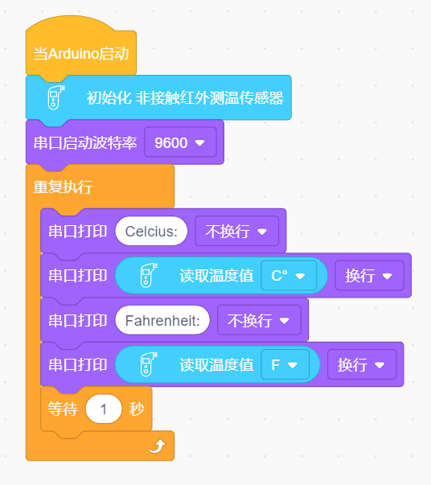
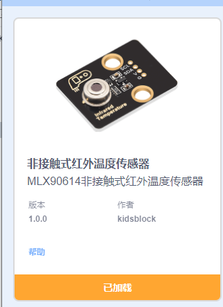
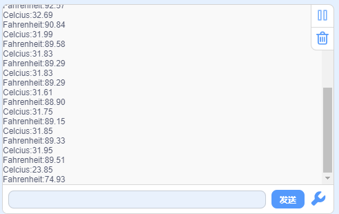

# KidsBlock

## 1. KidsBlock简介  

KidsBlock是一款面向儿童和初学者的图形化编程软件，旨在通过直观的拖拽界面来帮助用户学习编程概念。与传统的编码不同，KidsBlock通过在项目中使用模块化的代码块，使得编程变得更加容易和有趣。用户可以将这些代码块组合在一起，构建出复杂的程序，而无需熟练掌握语法。  

KidsBlock支持多种编程语言的转换，包括 Arduino C 和 Scratch。这种灵活性使得用户能够根据自己的需求和技能水平自由选择编程语言。同时，KidsBlock还配备了丰富的示例项目和教程，便于用户学习和掌握编程技巧，从而激发孩子们的创造力和解决问题的能力。  

## 2. 接线图  

  

## 3. 测试代码（测试软件版本：KidsBlock Desktop 1.1.2）  

  

## 4. 实验说明  

在实验中，我们需要先添加模块：  

  

## 5. 测试结果  

按照接线图连接后，上传代码并上电，打开串口监视器，设置波特率为9600，将手靠近模块的感应处，监视串口显示当前物体的温度（摄氏度和华氏度），如下图所示：  

