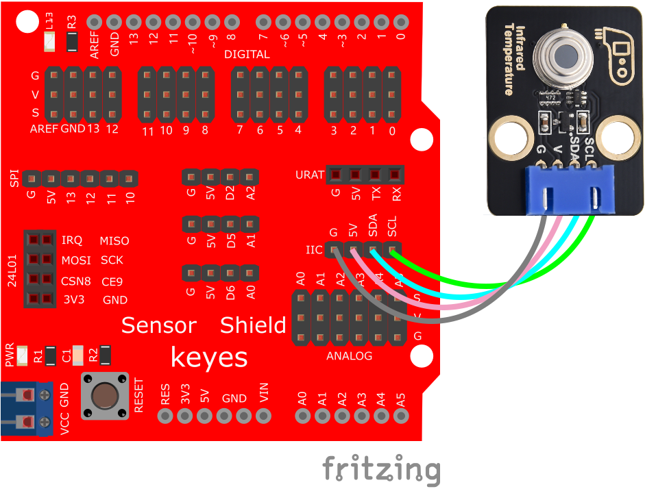
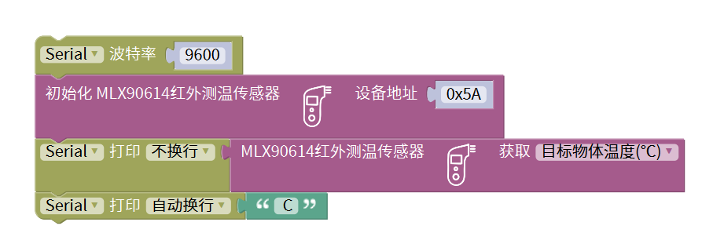
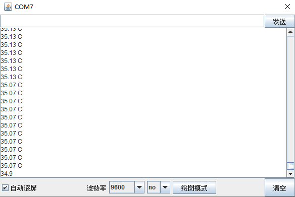

# Mixly

## 1. Mixly简介  

Mixly是一款基于图形化编程的教育工具，旨在帮助初学者和儿童通过直观的方式学习编程逻辑与技能。它允许用户通过拖拽模块来创建程序，简化了编程过程，同时支持Arduino编程和Scratch语言。Mixly的界面友好，用户可以轻松地将代码块连接在一起，实现复杂的控制逻辑。  

Mixly支持多种硬件平台，尤其适合与Arduino配合使用，帮助用户快速上手进行硬件编程。通过提供丰富的示例和项目，Mixly鼓励学生动手实践，培养他们的创新和解决问题的能力。这使得Mixly成为教育机构和个人学习的理想选择。  

## 2. 接线图  

  

## 3. 测试代码（测试软件版本：Mixly 1.2.0）  

  

## 4. 测试结果  

按照接线图连接后，上传代码并上电，打开串口监视器，设置波特率为9600，将手靠近模块的感应处，监视串口显示当前物体的温度，如下图所示：  

